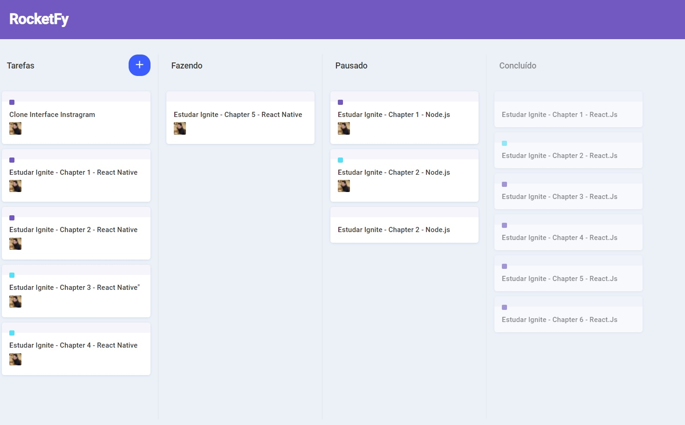

# Clone UI - Pipefy 💛🚀

Feito com 💙 por Hugo Alves Varella

&nbsp;

&nbsp;

  

## 📚 Informações sobre o projeto

- Esse projeto foi desenvolvido durante um video do youtube que recriava a pagina do dashboard do Pipefy - "https://www.pipefy.com/pt-br/".

&nbsp;

## 💻 O que tem no projeto?

- Adicionar Tarefa --------------------------------------#Fazendo
- Remove Tarefa.-----------------------------------------#fazendo
- Marca tarefa como concluida.-------------------------#Concluiida
- Deslocar tarefa entre colunas--------------------------#Concluiida
- Login social (Github , Facebook, Twitter, Google) -----#fazendo

&nbsp;

## 🛠️ Tecnologias/Ferramentas ultilizadas

- [React](https://pt-br.reactjs.org/E)
- [styled-components](https://styled-components.com/)
- [react-dnd](https://react-dnd.github.io/react-dnd/docs/overview)
- [immer](https://github.com/immerjs/immer)

